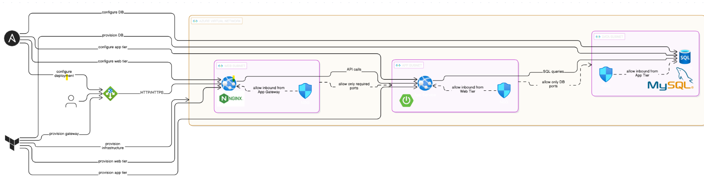
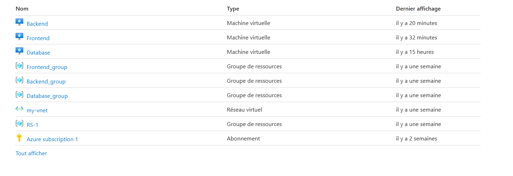
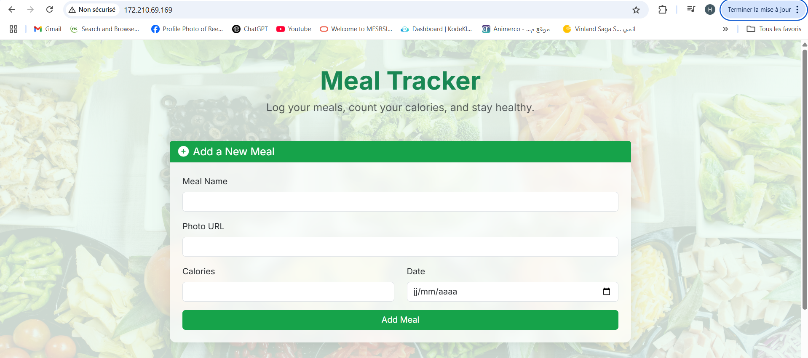
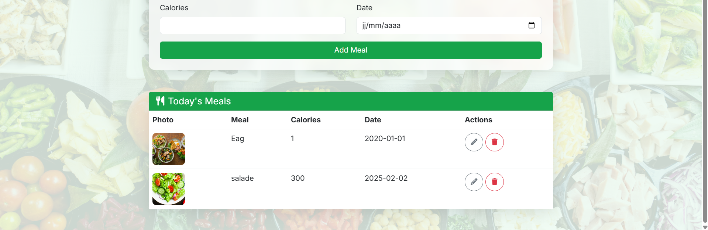

# 3-Tier Deployment on Azure with Terraform + Ansible


*3-Tier Architecture: Frontend - Backend - Database*

---

## 🚀 Overview

This project deploys a complete **3-tier** infrastructure on **Microsoft Azure** using a combination of:

* **Terraform** for Infrastructure as Code (IaC): provisioning VMs, networks, and security groups.
* **Ansible** for configuration and application deployment on each VM (Nginx, Spring Boot, MySQL).
* A **Meal Tracker** application deployed on this infrastructure, featuring:

  * An Nginx frontend serving a modern Bootstrap web interface.
  * A Spring Boot backend handling business logic.
  * A MySQL database hosted in a secure network.

---

## 📁 Project Structure

```plaintext
3-tier-deployment/
├── terraform/                     
├── ansible/                       
├── app/                           
├── docs/                         
│   ├── architecture-diagram.png     # 3-Tier architecture diagram
│   ├── azure-resources.png          # Screenshot of Azure resources (VMs, networks, NSGs)
│   └── meal-tracker/                # Screenshots of the Meal Tracker site
│       ├── meal-tracker-home.png
│       └── meal-tracker-add-meal.png
├── README.md                      
└── .gitignore                    
```

---

## 🖼️ Key Screenshots

| Description                         | Preview                                                         |
| ----------------------------------- | --------------------------------------------------------------- |
| **3-Tier Architecture**             |                 |
| **Deployed Azure Resources**        |                   |
| **Meal Tracker Website - Home**     |  |
| **Meal Tracker Website - Add Meal** |       |

---

## 🛠 Tech Stack

| Category           | Tools / Technologies              |
| ------------------ | --------------------------------- |
| IaC Infrastructure | Terraform (Azure Provider)        |
| Configuration      | Ansible (Playbooks + Roles)       |
| Servers            | Azure Virtual Machines            |
| Web Frontend       | Nginx + Bootstrap 5 + HTML5 + CSS |
| Backend            | Spring Boot (Java, app.jar)       |
| Database           | MySQL (installed via Ansible)     |

---

## ⚙️ How to Deploy?

### 1. Provision Azure Infrastructure with Terraform

```bash
cd terraform
terraform init
terraform apply
./generate_inventory.sh > ../ansible/inventory.ini
```

### 2. Deploy and Configure Applications with Ansible

```bash
cd ../ansible
ansible-playbook -i inventory.ini playbooks/db.yml
ansible-playbook -i inventory.ini playbooks/backend.yml
ansible-playbook -i inventory.ini playbooks/frontend.yml
```

### 3. Result

* Nginx serves the web page on the frontend public IP
* Spring Boot runs in the backend, communicating with the secure MySQL database
* Database is accessible only from the backend

---
